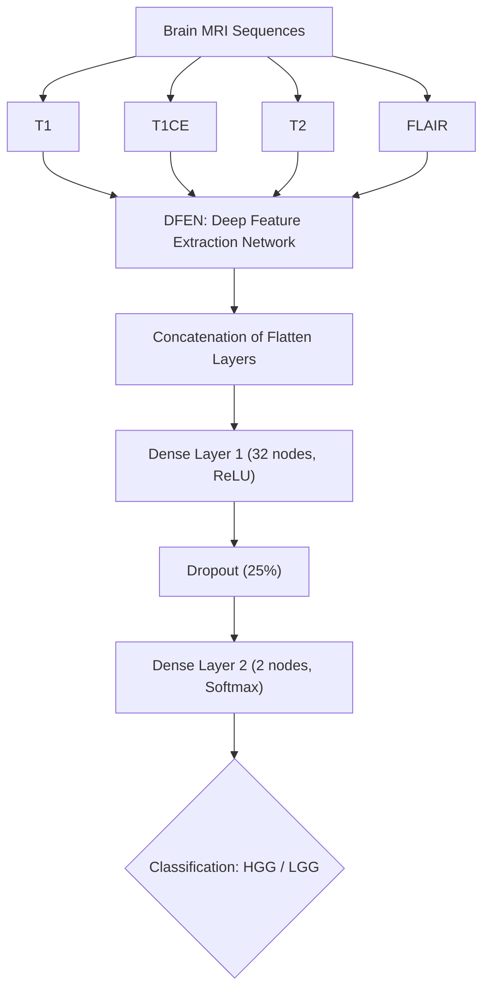

## *A Late Fusion Deep CNN Model for the Classification of Brain Tumors from Multi-Parametric MRI Images*

**Conference:** 2023 International Conference on Next-Generation Computing, IoT and Machine Learning (NCIM)

**DOI:** [10.1109/NCIM59001.2023.10212729](https://ieeexplore.ieee.org/document/10212729)

**Authors:** Anirban Barai, Md. Farukuzzaman Faruk, Shakil Mahmud Shuvo, Azmain Yakin Srizon, S.M. Mahedy Hasan, Abu Sayeed

---

### 🧩 Abstract

This study introduces a **late fusion deep convolutional neural network (CNN)** for classifying brain tumors using **multi-parametric MRI images (T1, T1ce, T2, FLAIR)**. By integrating features from distinct MRI sequences at a late stage, the model captures both unique and complementary representations. The proposed system achieved **97% test accuracy**, **98% precision**, **97% recall**, and **97% F1-score** — outperforming existing models such as VGG-19, ResNet101, and EfficientNet.

---

### 🧬 Methodology Overview

#### Dataset

* **Dataset Used:** BraTS 2019
* **Classes:** HGG (High-Grade Glioma) and LGG (Low-Grade Glioma)
* **Total Patients:** 335
* **Preprocessing:**

  * Extracted 2D slices from 3D MRI scans
  * Min-max normalization
  * Augmentation (cropping, flipping, rotation, zooming)

#### Architecture Overview

---

### ⚙️ Key Equations

1. **Slice Selection Formula:**

$$ [
pos_{mid} = \left\lfloor \frac{n_{slices}}{2} \right\rfloor
]
[
X_{slice} \sim U([pos_{mid} - 7, pos_{mid} + 7])
]
$$

2. **Feature Concatenation:**
$$
[
F_{concatenated} = \left( F_{T1}^T \oplus F_{T1CE}^T \oplus F_{T2}^T \oplus F_{FLAIR}^T \right)^T
]
$$
---

### 📊 Results and Performance

| Metric       | HGG  |  LGG | Average  |
| :----------- | :--: | :--: | :------: |
| Precision    | 0.98 | 0.97 |  0.975   |
| Recall       | 0.96 | 0.99 |  0.975   |
| F1-Score     | 0.97 | 0.98 |  0.975   |
| **Accuracy** |  —   |   —  | **~97%** |

**ROC-AUC:** 0.99
**Training Environment:** Kaggle GPU (Tesla P100, 16GB VRAM)
**Optimizer:** Adam (LR = 0.0001, decay = 0.96)

---

### 📈 Model Visualization

* **Feature Maps:** Extracted using DFEN from each MRI sequence (T1, T1CE, T2, FLAIR).
* **Confusion Matrix:** Misclassified only 3 samples out of all test data.
* **AUC Curve:** Shows near-perfect discrimination between HGG and LGG.

---

### 🧠 Conclusion

The **Late Fusion CNN** effectively combines multi-sequence MRI data, achieving superior performance and robust generalization. Future work aims to extend the framework into **brain tumor segmentation** using **GAN-generated synthetic data** to address limited dataset sizes.

---
